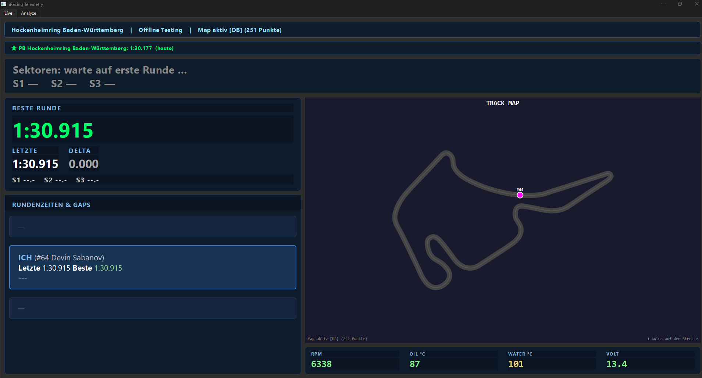
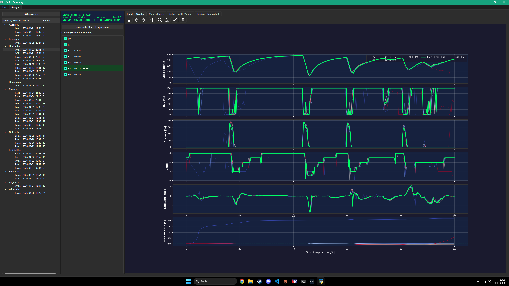
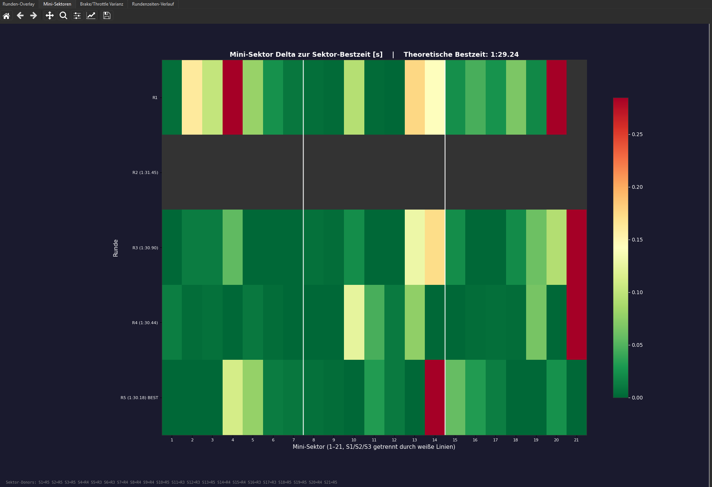

# iRacing Telemetry Tool

A real-time + post-session telemetry workstation for iRacing, built on PySide6.
Logs every tick to CSV, maps the track on your first lap, and produces
Motec-style analysis when the session ends: mini-sector heatmap, theoretical
best lap, brake-point variance, lap overlays, and interactive browsing of past
sessions.

The live tab shows you the track, your opponents, current-session sector
deltas, car status, and your all-time personal best at the current track. The
analyze tab lets you browse every session you've ever logged.



---

## Features

### Live tab (driving)

- **Personal-best banner** — shows your all-time fastest lap at the current track and when you set it, scanned across every past session in `race_logs/`.
- **Live sector-delta banner** — as you cross each of the 3 main sector boundaries, shows the just-completed sector's time with delta to your session best. Star marker for new bests.
- **Qualifying panel** — large best/last/delta display, auto-emphasised in Qualifying sessions.
- **Timing panel** — car ahead + you + car behind, with gaps, per-lap delta, sector times, and "will catch / will be caught in ~N laps" projections.
- **Track map** — live positions of all cars, coloured by classification position.
- **Car-status panel** — RPM, oil temp, water temp, voltage, with green/yellow/red threshold coloring.
- **Auto-finalize** — 5 s after iRacing disconnects, if you completed ≥ 1 lap, the session finalizes automatically (plots + summaries). No Ctrl+C required.

### Analyze tab (post-session)

- **Session tree** — all your past sessions grouped by track, with lap-time labels.
- **Lap overlay** — interactive matplotlib plot of Speed / Gas / Brake / Gear / Steering / Delta-to-Best across track position. Click a lap's legend entry to toggle it.
- **Mini-sector heatmap** — 21 sectors × N laps, coloured by delta to sector-best. 3 main-sector dividers drawn. Title shows theoretical best time.
- **Brake / throttle / steering variance** — three per-corner bar charts: hard-braking zones (heavy brake application), throttle-release points (where you lift), and steering turn-in points (derived from `|SteeringWheelAngle| > 11°` — catches every corner, including flat-out sweepers where you don't brake). Each chart shows mean position + standard deviation + lap count across the session, so you can spot which corners you're inconsistent at.
- **Lap-time progression** — scatter + line of lap number → lap time, with skipped laps (out/in/start/finish) marked with grey Xs, theoretical best as a dashed line.
- **CSV export** — dump the 21 theoretical-best sectors + donor laps + delta to best actual lap as a CSV for external analysis.




---

## How the analysis actually works

### Mini-sectors and theoretical best

Each lap is split into 21 equal-width mini-sectors on `LapDistPct ∈ [0, 1]`,
organised as 3 main sectors × 7 mini-sectors. Sector times are interpolated
between ticks using `LapCurrentLapTime`, anchored at
(pct=0, t=0) and (pct=1, t=LapTime). Laps are rejected from the theoretical
best if any of these integrity checks fail:

- Coverage < 90 % of the track (partial laps).
- First recorded pct > 5 % or last pct < 99 % (S/F-crossing data gap).
- `|last_LCLT − LapTime| > 0.5 s` (iRacing clock desync).

Theoretical best = sum of the fastest time recorded in each of the 21
sectors across all accepted laps.

### Lap filtering

`telemetry/lap_data.py:filter_laps` drops:

- Any lap with `OnPitRoad == True` at any tick (outlap / inlap / pit).
- **Race sessions**: laps entirely before green flag, the first lap after
  green (rolling-start artifacts), and laps that span or start after the
  checkered flag. Green/checkered detected via `SessionFlags`.
- **Practice / Qualifying**: just the first lap (flags unreliable).

### Brake / throttle / steering variance

Three parallel detectors:

- **Brake** — rising-edge above 10 % (hard braking only; Formula cars at
  Hockenheim GP genuinely brake at ~5 zones, the rest are lift-only).
- **Throttle** — falling-edge below 90 % (captures every lift, light and
  heavy).
- **Steering** — rising-edge above 0.2 rad (~11°), direction-agnostic. This
  is the one that maps to the track's total corner count (13-16 on
  Hockenheim GP), including flat-out sweepers where you never touch the
  brake.

Events from all laps are clustered by track-position proximity
(ε = 1.5 % ≈ 68 m) — each cluster ≈ one corner. The chart reports per-corner
min / max / mean / standard deviation across the laps in the session.

---

## Installation

Requires Python 3.11+ on Windows with iRacing installed.

```bash
pip install -r requirements.txt
```

Dependencies:

- `pyirsdk` — shared-memory interface to iRacing
- `PySide6` — the GUI
- `matplotlib`, `numpy` — analysis & plotting
- `rich` — terminal output for the legacy CLI

---

## Usage

### GUI (recommended)

```bash
python app.py
```

Start iRacing first. The Live tab populates within a second of going on-track.
Close iRacing when you're done with a session — the tool auto-finalizes after
5 seconds. Your session's folder will contain:

- `telemetry_detailed.csv` — 10 Hz tick data (every channel)
- `lap_summary.csv` — one row per completed lap
- `session_meta.json` — track, car, session type, start time
- `session_summary.txt` — human-readable summary
- `position_graph.png`, `lap_analysis.png`, `lap_delta_analysis.png`,
  `mini_sectors.png`, `brake_throttle_variance.png` — analysis plots

### CLI (legacy)

```bash
python main.py
```

Terminal-only, no interactive analyze UI. Still auto-finalizes on
disconnect. Ctrl+C also works.

### Re-analyze an older session

```bash
python -m telemetry.lap_analysis race_logs/<session_folder>
```

Regenerates all PNGs + prints the theoretical best to stdout. Accepts
`--include-all` to disable the outlap / inlap / start / finish filters, and
`--no-viewer` if you only want the PNGs.

---

## Project layout

```
app.py                     PySide6 GUI entry point
main.py                    Terminal CLI entry point (legacy)
config.py                  Tunables: tick rates, thresholds, UI sizes

gui/
  live_tab.py              Live tab: map + timing + sectors + car status
  analyze_tab.py           Analyze tab: session tree + 4 plot sub-tabs + CSV export
  worker.py                QThread worker that drives iRacing + emits snapshots
  timing_panel.py          Ahead / you / behind gap display
  qualifying_panel.py      Large best-lap display (emphasised in quali)
  map_widget.py            Track map canvas
  car_status_panel.py      RPM / oil / water / voltage with thresholds
  lap_plot_widget.py       Interactive overlay plot (used inside analyze tab)
  log_browser_model.py     Tree model for race_logs/ browsing

telemetry/
  connection.py            Shared-memory interface, non-blocking check_connection
  data_logger.py           10 Hz CSV writers + per-lap aggregation
  lap_analysis.py          Post-session PNG generation + CLI re-analysis
  lap_data.py              Pure data helpers shared by GUI + PNG paths
  mini_sectors.py          21-sector interpolation + theoretical-best math
  variance_analysis.py     Brake/throttle event clustering
  session_meta.py          session_meta.json read/write
  session_history.py       Cross-session PB scanner
  timing.py                SectorTracker + CatchCalculator + TimingMonitor
  session.py               SessionMonitor (track info, weather)
  track_map.py             Live track-layout recorder
  track_db.py              Saved track layouts (JSON) + sector splits
  pit_window.py            Fuel / pit window estimator
  tires.py                 Tire data wrapper (where iRacing exposes it)

display/                   Legacy CLI-only display (Rich terminal + Tk map window)

tests/
  test_lap_data.py         Pure-function tests for the data layer
  test_log_browser_model.py

track_db/                  Per-track layout JSON (generated on first mapping lap)
race_logs/                 (gitignored) Per-session output folders
```

---

## Data flow

```
iRacing (shared memory)
  └─► IRacingConnection (non-blocking polling)
        └─► TelemetryWorker (QThread, 10 Hz)
              ├─► DataLogger  ──► race_logs/<session>/telemetry_detailed.csv
              │                   race_logs/<session>/lap_summary.csv
              │                   race_logs/<session>/session_meta.json
              ├─► TrackMapper ──► track_db/<track>.json
              ├─► TimingMonitor (sectors, gaps, catch-time)
              └─► snapshot signal ──► LiveTab.on_snapshot
                                       ├─► TimingPanel
                                       ├─► QualifyingPanel
                                       ├─► MapWidget
                                       ├─► CarStatusPanel
                                       └─► sector-delta + PB labels

on session end (iRacing closes / worker.stop):
  └─► generate_session_summary  ──► session_summary.txt, position_graph.png
  └─► generate_lap_analysis     ──► lap_analysis.png, lap_delta_analysis.png,
                                     mini_sectors.png, brake_throttle_variance.png
```

---

## Screenshots

> Drop your screenshots into `docs/screenshots/` with the filenames below and
> they'll render here.

- `docs/screenshots/live-tab.png` — Live tab with PB banner + sector delta
- `docs/screenshots/analyze-tab.png` — Analyze tab with 4 sub-tabs
- `docs/screenshots/mini-sectors.png` — Mini-sector heatmap
- `docs/screenshots/variance.png` — Brake/throttle variance
- `docs/screenshots/lap-overlay.png` — Lap overlay with best lap highlighted

---

## Language

GUI labels are in German ("Warte auf iRacing", "Theoretische Bestzeit",
"Runden", etc.) because the author drives in German. The code and docs are
in English. Open a PR if you want localized labels.

---

## Limitations / known issues

- Formula-car focus: ABS / traction control indicators are intentionally not
  logged (the target car is a Formula without driver aids).
- iRacing occasionally tags a few ticks past S/F with the old lap number.
  `mini_sectors.py` detects this via a `LapTime` consistency check and
  rejects those laps from theoretical-best math.
- Closing the terminal window with the X button on Windows does NOT reliably
  trigger Python's `finally` blocks. The QThread's graceful shutdown handles
  the "iRacing closed" case; the "close terminal mid-session" case may skip
  finalization.

---

## License

None declared yet — this is a personal project. Feel free to fork.
